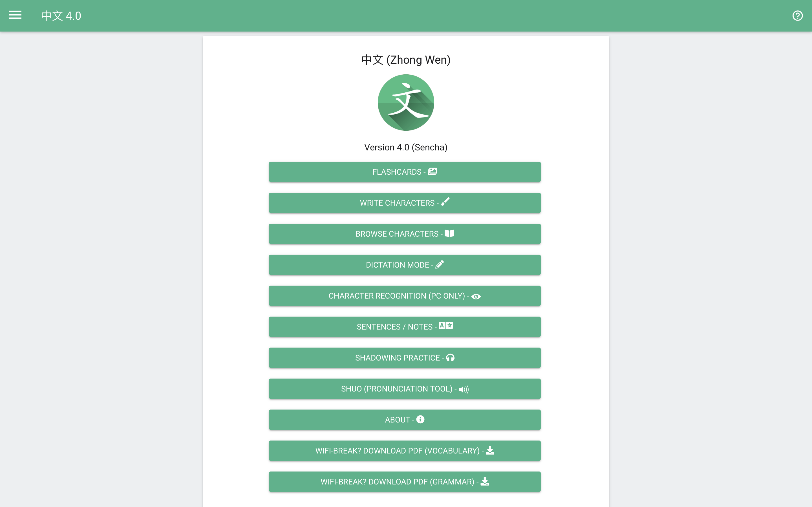
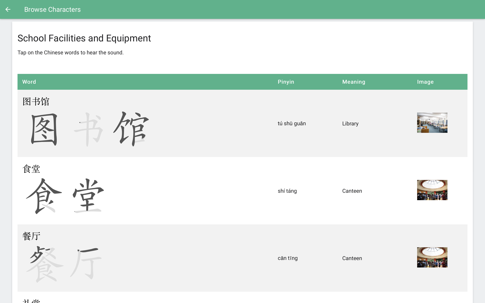
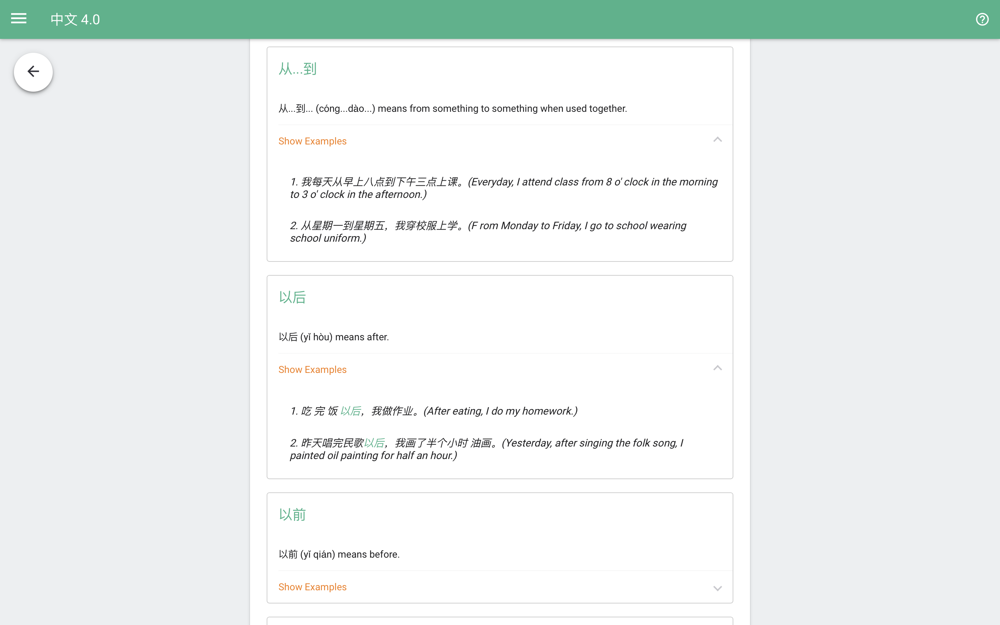
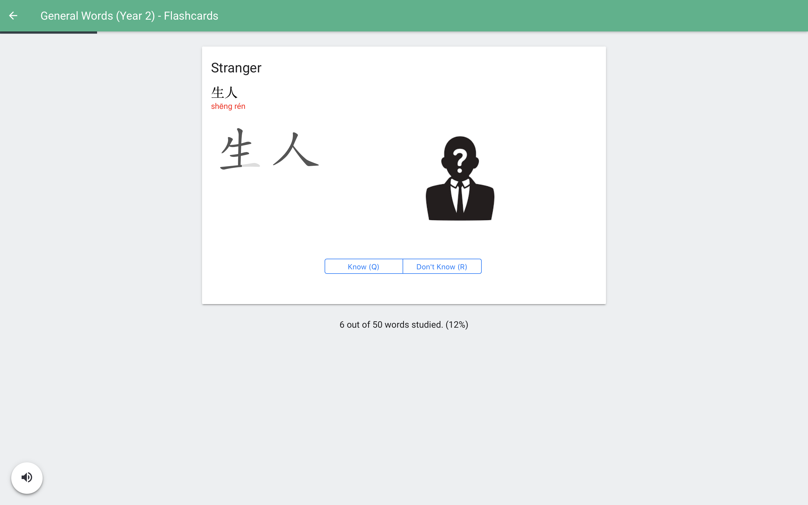
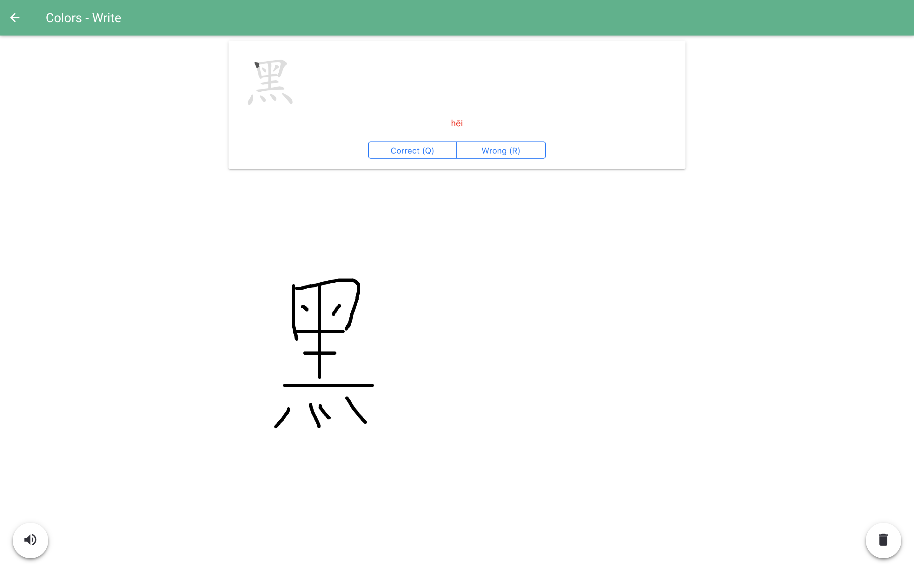

# Previous versions
Oldest, but functional ZhongWen 2.0 - (http://paingthet.com/coding/zhongwen/)

Fully functional ZhongWen 3.0 (Cherry Blossoms) at (http://zw.paingthet.com). This is for IB Mandarin Ab Initio Level.

# Zhong-Wen-4-Sencha

Zhong Wen 4 (Sencha) is the Chinese revision platform for University level Chinese and beyond.

Currently, fully functional and hosted at (http://zw4.paingthet.com)

Current features include

### Browsing the Chinese Character Database

### Browsing the Sentence Structures

### Flashcards with animated strokes

### Writing Characters

